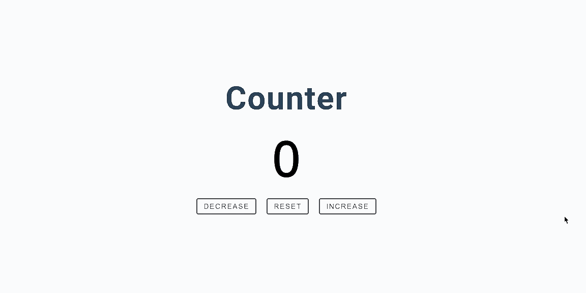

# 15JavascriptProjects

This project is part of the [freecodecamp](https://www.youtube.com/watch?v=3PHXvlpOkf4) JavaScript course - Build 15 javaScript Projects with Vanilla JS.

## Project 01 - Color Random
This project generates random color based on two options: simple (with a set of seven basic colors) and hex (which can be any hex color).

#### Skills:
- Math.floor
- Math.random

##### [See the Code](https://github.com/ynaraoliveira/15JavascriptProjects/tree/master/projects/01-color-random)

## Project 02 - Counter
With the buttons you can increase, decrease and reset the count. If the number is greater than 0 then the number is shown in green color. If it's less than zero then the color is red.

#### Skills:
- addEventListener
- forEach
- currentTarget

##### [See the Code](https://github.com/ynaraoliveira/15JavascriptProjects/tree/master/projects/02-counter)

## Project 03 - Review
With the buttons you can access the next and previous review in the array switching the information name, job, image and text attached to an id for each review in the array.

#### Skills:
- array
- DOMContentLoaded

##### [See the Code](https://github.com/ynaraoliveira/15JavascriptProjects/tree/master/projects/03-review)
