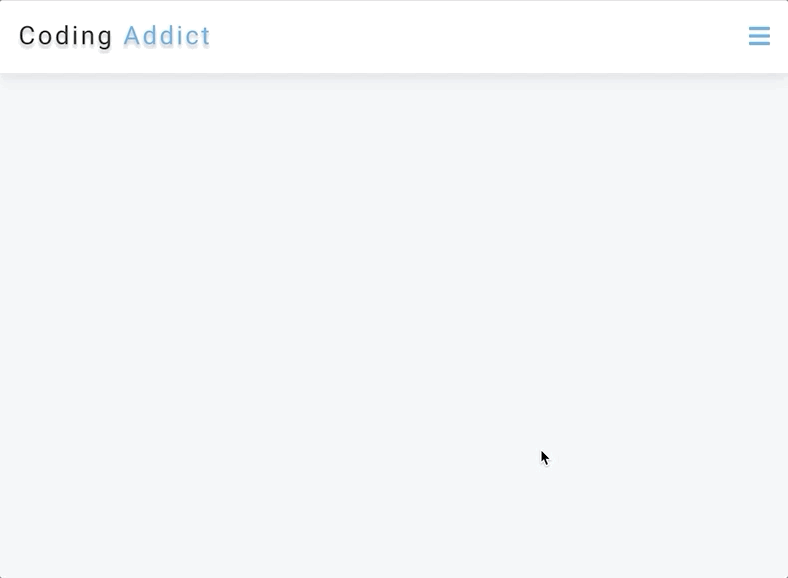

# 15JavascriptProjects

This project is part of the [freecodecamp](https://www.youtube.com/watch?v=3PHXvlpOkf4) JavaScript course - Build 15 javaScript Projects with Vanilla JS.

##### The projects:
01 - Color Random 
02 - Counter 
03 - Review 
04 - Hamburger Menu 
05 - Sidebar 
06 - Card Flip 
07 - Questions 
08 - Menu 
09 - Video 
10 - Scroll 
11 - Tabs 

## Project 01 - Color Random
This project generates random color based on two options: simple (with a set of seven basic colors) and hex (which can be any hex color).

#### Skills:
- Math.floor
- Math.random

##### [See the Code](https://github.com/ynaraoliveira/15JavascriptProjects/tree/master/projects/01-color-random)

## Project 02 - Counter
With the buttons you can increase, decrease and reset the count. If the number is greater than 0 then the number is shown in green color. If it's less than zero then the color is red.

#### Skills:
- addEventListener
- forEach
- currentTarget

##### [See the Code](https://github.com/ynaraoliveira/15JavascriptProjects/tree/master/projects/02-counter)

## Project 03 - Review
With the buttons you can access the next and previous review in the array switching the information name, job, image and text attached to an id for each review in the array.

#### Skills:
- array
- DOMContentLoaded

##### [See the Code](https://github.com/ynaraoliveira/15JavascriptProjects/tree/master/projects/03-review)

## Project 04 - Hamburguer Menu
This project creates a drop down menu for smaller screen sizes. 

#### Skills:
- classList
- contains
- add / remove classes
- toggle

##### [See the Code](https://github.com/ynaraoliveira/15JavascriptProjects/tree/master/projects/04-hamburger-menu)

## Project 05 - Sidebar
This project creates a sidebar menu using the toggle method. 

#### Skills:
- classList
- toggle

##### [See the Code](https://github.com/ynaraoliveira/15JavascriptProjects/tree/master/projects/05-sidebar)

## Project 06 - Card Flip
This project creates a card flip effect so a hidden content can be visible once the button is clicked. 

#### Skills:
- classList
- add / remove class

##### [See the Code](https://github.com/ynaraoliveira/15JavascriptProjects/tree/master/projects/06-modal)

## Project 07 - Questions
In this project the user can see the answer to the questions when clicking the button. Only one answer is shown at a time.

#### Skills:
- querySelectorAll
- forEach
- parentElement

##### [See the Code](https://github.com/ynaraoliveira/15JavascriptProjects/tree/master/projects/07-questions)

## Project 08 - Menu
With this menu project the user can see the items available for each menu category. The coding was made dinamically so in case a new item with a new category is added a button will automatically appear with the name of the category. 

#### Skills:
- map
- reduce
- push
- filter

##### [See the Code](https://github.com/ynaraoliveira/15JavascriptProjects/tree/master/projects/08-menu)

## Project 09 - Video
There's an animated preloader on screen while the video is loading and the user can control whether play or pause the video on the main page.

#### Skills:
- pause()
- play()

##### [See the Code](https://github.com/ynaraoliveira/15JavascriptProjects/tree/master/projects/09-video)

## Project 10 - Scroll
In this page the copyright date is set to be updated autocatically; the navbar heigth on smaller screen is set to be dinamic in case more links are added and there is a smooth scroll effect using offsetTop to go exactly on the top of the page.  

#### Skills:
- getBoudingClientRect()
- pageYOffset
- offsetTop

##### [See the Code](https://github.com/ynaraoliveira/15JavascriptProjects/tree/master/projects/10-scroll)

## Project 11 - Tabs
The user can see different content when clicking on the tabs.

#### Skills:
- forEach()
- target
- dataset

##### [See the Code](https://github.com/ynaraoliveira/15JavascriptProjects/tree/master/projects/11-tabs)
